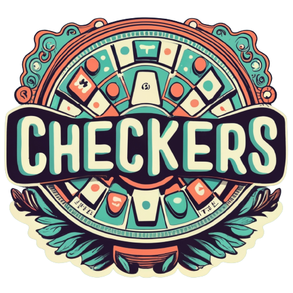

# Checkers Game

Welcome to my Checkers Game project! This web-based Checkers game is implemented using JavaScript, HTML, and ASP.NET.

## Table of Contents
- [Description](#description)
- [Features](#features)
- [Installation](#installation)
- [Usage](#usage)
- [Contributing](#contributing)
- [License](#license)

## Description
This Checkers Game is a classic board game implemented as a web application. The project uses JavaScript for the game logic, HTML for the structure, and ASP.NET for backend functionality. Enjoy a game of Checkers with a clean and interactive user interface.

## Features
Interactive Board: Play Checkers on a user-friendly and responsive game board.
Multiplayer Support: Challenge a friend for a two-player match.
Game Logic: Implemented using JavaScript for a smooth and enjoyable gaming experience.
ASP.NET Backend: Leverage the power of ASP.NET for server-side functionalities.

## Installation
Clone the repository to your local machine:

git clone https://github.com/ItayShallev/Checkers.git  
Open the project in your preferred code editor.

Run the application using an ASP.NET development server.

## Usage
Navigate to the game board in your web browser.

Choose your game mode (single-player or multiplayer).

Enjoy the game by making moves using the interactive interface.

## Contributing
Contributions are welcome! If you have any ideas for improvements or find any issues, feel free to open an issue or submit a pull request.

## License
This Checkers Game project is licensed under Itay Shalev.
